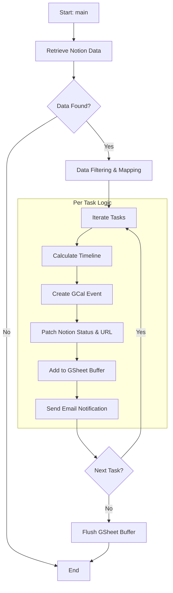
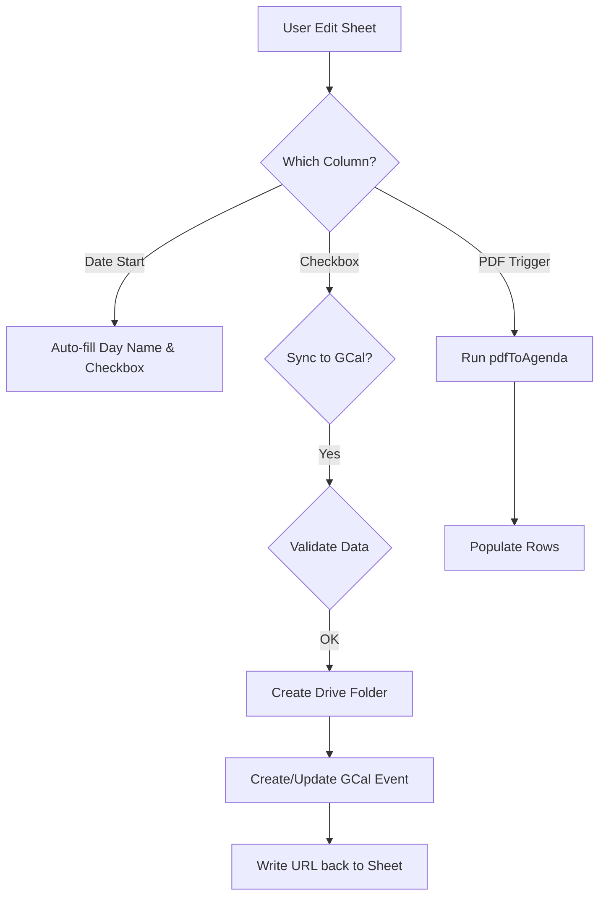

# Notion-GWS Workflows Hub

Sistem integrasi otomatis untuk sinkronisasi tugas/agenda dari Notion ke ekosistem Google Workspace (Calendar, Sheets, Mail).

## Deskripsi Fungsional
Skrip ini (`taskSync.gs`) mengambil data dari basis data Notion dan melakukan orkestrasi ke beberapa layanan Google:
1.  **Notion Query**: Mengambil halaman dengan kriteria tertentu (Status: To Do/In Progress, SyncGWS: Yes).
2.  **Timeline Calculation**: Menghitung waktu mulai dan akhir tugas berdasarkan properti Notion atau logika mapping prioritas (Low/Medium/High).
3.  **Google Calendar**: Membuat event kalender dengan deskripsi HTML yang kaya dan link interaktif kembali ke Notion.
4.  **Notion Update**: Memperbarui halaman Notion untuk menandai sinkronisasi berhasil dan menyimpan link Google Calendar.
5.  **Google Sheets**: Mencatat log agenda ke dalam sheet "Sheet1" secara efisien menggunakan buffering.
6.  **Email Notification**: Mengirim notifikasi email berisi detail tugas kepada user tertentu.

### Agenda Sheet Logic (`agenda.gs`)
Skrip ini mengelola interaksi langsung pada Google Sheets:
1.  **On-Edit Automation**: Mengisi nama hari secara otomatis dan membuat checkbox saat tanggal diinput.
2.  **PDF Parsing Interface**: Antarmuka khusus untuk memicu parsing data dari PDF ke baris agenda.
3.  **Direct GCal Sync**: Sinkronisasi manual dari Sheet ke Google Calendar melalui trigger checkbox.
4.  **Auto Folder Creation**: Otomatis membuat folder di Google Drive untuk setiap agenda baru guna menyimpan dokumen pendukung.

## Alur Kerja (Current Flow)

### 1. Notion to GWS Sync (`taskSync.gs`)

### 2. Sheet Interface Logic (`agenda.gs`)

## Setup & Konfigurasi
Skrip ini membutuhkan `ScriptProperties` berikut:
- `DATABASE_ID`: ID basis data Notion.
- `NOTION_TOKEN`: Integration token Notion.
- `SPREADSHEET_ID`: ID Google Sheets target.
- `CALENDAR_ID`: ID Google Calendar target.
- `PAGE_ID`: ID Halaman Notion (opsional).
- `MASTER_TAG_DATABASE_ID`: ID basis data tag di Notion.
- `tagMap`: Cache mapping tag (otomatis terisi).
