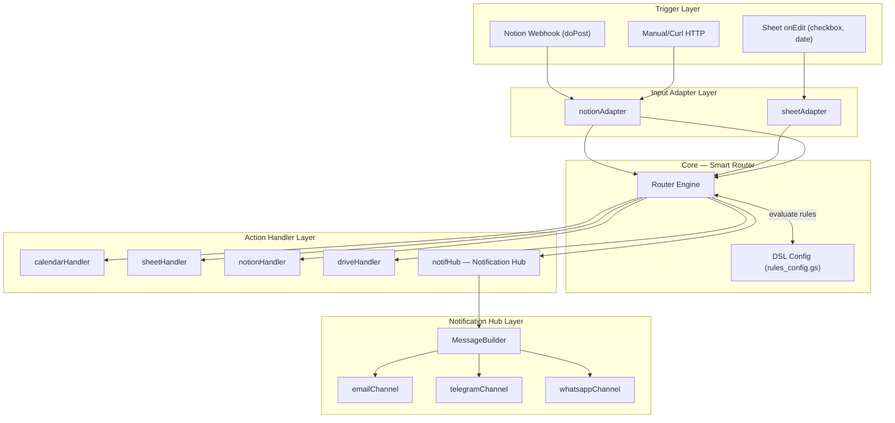
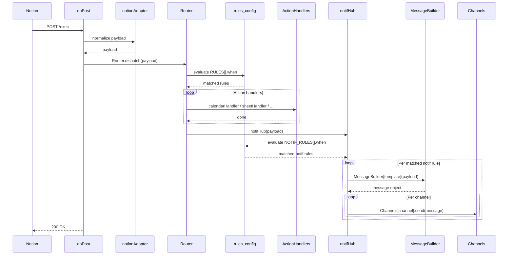

# Implementation Plan: Smart Webhook — DSL Router

Konsolidasi **dua workflow terpisah** (`taskSync.gs` dan `agenda.gs`) menjadi **satu entrypoint webhook** yang cerdas, berbasis DSL. Setiap aturan bisnis dinyatakan sebagai konfigurasi deklaratif — bukan code tersebar.

---

## Latar Belakang & Masalah

| Kondisi Saat Ini | Target |
|---|---|
| Polling manual via `main()` (scheduled trigger) | Event-driven via Notion Webhook / onEdit |
| Logic bisnis tersebar di `taskSync.gs` & `agenda.gs` | Logic terpusat di DSL config |
| Sulit menambah workflow baru tanpa menyentuh core | Tambah rule = tambah satu blok JSON |
```markdown
| Dua titik masuk berbeda | Single Entrypoint: `doPost(e)` (Sheet `onEdit` diproxy ke Webhook) |
```
| Notifikasi hanya via Email, hardcoded | Notification Hub: message builder + multi-channel (Email, Telegram, WhatsApp) via DSL |

---

## Arsitektur Target



---

## DSL Config — Format & Contoh

DSL didefinisikan sebagai array JSON. Setiap rule memiliki:
- `id` — nama unik rule
- `when` — ekspresi JavaScript (dievaluasi terhadap `payload`)
- `execute` — array nama handler yang akan dijalankan secara berurutan

### `rules_config.gs`

```javascript
const RULES = [
  {
    id: "notion-task-sync",
    description: "Sync Notion task (To Do/In Progress) to GCal + Sheets + Notif",
    when: "payload.source === 'notion' && payload.sync === 'Yes' && ['To Do','In Progress'].includes(payload.status)",
    execute: ["calendarHandler", "notionHandler", "sheetHandler", "notifHub"]
  },
  {
    id: "sheet-agenda-create",
    description: "Checkbox di-tick → buat GCal event + Google Drive folder",
    when: "payload.source === 'sheet' && payload.col === 15 && payload.value === true && !payload.calUrl",
    execute: ["driveHandler", "calendarHandler"]
  },
  {
    id: "sheet-agenda-update",
    description: "Edit baris yang sudah ada event-nya → update GCal event",
    when: "payload.source === 'sheet' && payload.col !== 15 && payload.calUrl !== ''",
    execute: ["calendarHandler"]
  },
  {
    id: "sheet-pdf-parse",
    description: "Trigger checkbox PDF parsing di row 1",
    when: "payload.source === 'sheet' && payload.col === 7 && payload.row === 1 && payload.value === true",
    execute: ["pdfHandler"]
  }
];

// ─── Notification Hub Config ───────────────────────────────────────────────
// Dipisah dari RULES utama agar bisa dikonfigurasi sendiri per event
const NOTIF_RULES = [
  {
    id: "notif-new-task",
    description: "Tugas baru dari Notion → kirim ke Email + Telegram",
    when: "payload.source === 'notion' && payload.status === 'To Do'",
    template: "newTaskTemplate",   // nama fungsi message builder
    channels: ["email", "telegram"]
  },
  {
    id: "notif-task-done",
    description: "Tugas selesai → kirim ke Telegram saja",
    when: "payload.source === 'notion' && payload.status === 'Done'",
    template: "taskDoneTemplate",
    channels: ["telegram"]
  },
  {
    id: "notif-agenda-created",
    description: "Agenda baru dari Sheet → notif WhatsApp",
    when: "payload.source === 'sheet' && payload.col === 15 && payload.value === true",
    template: "agendaCreatedTemplate",
    channels: ["whatsapp"]
  }
];
```

---

## Struktur File Baru

```
workflows-hub/
├── webhook.gs              [NEW]  — doPost(e), installableOnEdit, entry point
├── router.gs               [NEW]  — Router class: evaluate DSL + dispatch
├── rules_config.gs         [NEW]  — RULES + NOTIF_RULES (DSL definitions)
├── adapters.gs             [NEW]  — notionAdapter, sheetAdapter (input normalizer)
│
├── calendarHandler.gs      [NEW]  — create/update GCal event
├── sheetHandler.gs         [NEW]  — write to Google Sheets (buffered)
├── notionHandler.gs        [NEW]  — PATCH Notion page (status, URL)
├── driveHandler.gs         [NEW]  — create folder, move file
├── pdfHandler.gs           [NEW]  — parse PDF ke agenda rows
│
├── notifHub.gs             [NEW]  — Notification Hub: evaluate NOTIF_RULES
├── messageBuilder.gs       [NEW]  — template functions per event type
├── channels/
│   ├── emailChannel.gs     [NEW]  — send via MailApp
│   ├── telegramChannel.gs  [NEW]  — send via Telegram Bot API
│   └── whatsappChannel.gs  [NEW]  — send via WhatsApp API (e.g. Fonnte/WA Cloud)
│
├── taskSync.gs             [KEEP] — helpers: getTagMap, timespan, buildCalendarDescription, dll
└── agenda.gs               [KEEP] — helpers: generateEmails, getTimestamp, generateOutputString, dll
```

---

## Implementasi Step-by-Step

### Step 1 — `webhook.gs` (Entry Point)

```javascript
function doPost(e) {
  try {
    const raw = JSON.parse(e.postData.contents);
    const payload = notionAdapter(raw);
    Router.dispatch(payload);
    return ContentService
      .createTextOutput(JSON.stringify({ status: 'ok' }))
      .setMimeType(ContentService.MimeType.JSON);
  } catch (err) {
    Logger.log('doPost error: ' + err.message);
    return ContentService
      .createTextOutput(JSON.stringify({ status: 'error', message: err.message }))
      .setMimeType(ContentService.MimeType.JSON);
  }
}

// installableOnEdit meneruskan ke router yang sama
function installableOnEdit(e) {
  const payload = sheetAdapter(e);
  Router.dispatch(payload);
}
```

### Step 2 — `router.gs` (Router Engine)

```javascript
const Router = {
  dispatch(payload) {
    const matched = RULES.filter(rule => {
      try {
        return new Function('payload', `return (${rule.when})`)(payload);
      } catch (err) {
        Logger.log(`Rule [${rule.id}] eval error: ` + err.message);
        return false;
      }
    });

    if (matched.length === 0) {
      Logger.log('No matching rule for payload: ' + JSON.stringify(payload));
      return;
    }

    for (const rule of matched) {
      Logger.log(`▶ Executing rule: ${rule.id}`);
      for (const handlerName of rule.execute) {
        Handlers[handlerName](payload);
      }
    }
  }
};
```

### Step 3 — `adapters.gs` (Normalize Payload)

```javascript
// Mengubah Notion Webhook payload → format standar
function notionAdapter(raw) {
  const props = raw.data?.properties || {};
  return {
    source: 'notion',
    pageId: raw.data?.id,
    title: props.Name?.title?.[0]?.text?.content || '',
    status: props.Status?.select?.name || '',
    sync: props.syncGWS?.select?.name || '',
    priority: props.Priority?.select?.name || '',
    startDate: props['Schedule date']?.date?.start || null,
    endDate: props['Schedule date']?.date?.end || null,
    workPeriod: props['Periode Pengerjaan (hari)']?.number || 0,
    location: props.Location?.rich_text?.[0]?.text?.content || '',
    url: raw.data?.url || '',
    people: props.PIC?.people || [],
    relation: props['Master Tags Database']?.relation || [],
  };
}

// Mengubah onEdit event → format standar
function sheetAdapter(e) {
  return {
    source: 'sheet',
    row: e.range.getRow(),
    col: e.range.getColumn(),
    value: e.value === 'TRUE' ? true : (e.value === 'FALSE' ? false : e.value),
    oldValue: e.oldValue,
    rowData: e.source.getActiveSheet()
      .getRange(e.range.getRow(), 2, 1, 16).getValues()[0],
    calUrl: e.source.getActiveSheet()
      .getRange(e.range.getRow(), 16).getValue() || '',
  };
}
```

### Step 4 — `calendarHandler.gs` (Refactored)

```javascript
const Handlers = {};

Handlers.calendarHandler = function(payload) {
  if (payload.source === 'notion') {
    const option = {
      description: buildCalendarDescription(payload),
      location: payload.location,
      guests: getEmail(payload.people),
      sendInvites: true,
    };
    const urlCal = createEventCal(payload.title, payload.startDate, payload.endDate, option);
    payload._calUrl = urlCal; // diteruskan ke handler berikutnya
  } else if (payload.source === 'sheet' && payload.calUrl) {
    updateCalendar(payload); // update event yang ada
  } else if (payload.source === 'sheet' && !payload.calUrl) {
    createCalendar(payload); // buat event baru
  }
};
```

> Handler lain (`notionHandler`, `sheetHandler`, `driveHandler`, `pdfHandler`) mengikuti pola yang sama — satu fungsi publik yang menerima `payload`.

---

### Step 5 — `notifHub.gs` (Notification Hub)

Titik terpusat untuk semua notifikasi. `notifHub` dipanggil oleh Router, lalu mengevaluasi `NOTIF_RULES` secara independen.

```javascript
// notifHub.gs
Handlers.notifHub = function(payload) {
  const matched = NOTIF_RULES.filter(rule => {
    try {
      return new Function('payload', `return (${rule.when})`)(payload);
    } catch (e) {
      return false;
    }
  });

  for (const rule of matched) {
    Logger.log(`📣 Notif rule matched: ${rule.id}`);
    const message = MessageBuilder[rule.template](payload); // build pesan
    for (const channel of rule.channels) {
      Channels[channel].send(message, payload);             // kirim ke channel
    }
  }
};
```

---

### Step 6 — `messageBuilder.gs` + `channels/*.gs`

**`messageBuilder.gs`** — fungsi template, menghasilkan objek `{ subject, text, html }` yang channel-agnostic:

```javascript
const MessageBuilder = {
  newTaskTemplate(payload) {
    return {
      subject: `🔔 Tugas Baru: ${payload.title}`,
      text:    `Tugas baru: *${payload.title}*\nStatus: ${payload.status}\nPrioritas: ${payload.priority}\nURL: ${payload.url}`,
      html:    `<b>Tugas Baru</b>: ${payload.title}<br>Status: ${payload.status}` // untuk email
    };
  },
  taskDoneTemplate(payload) {
    return {
      subject: `✅ Tugas Selesai: ${payload.title}`,
      text:    `Tugas *${payload.title}* sudah selesai.`,
      html:    `<b>✅ Selesai:</b> ${payload.title}`
    };
  },
  agendaCreatedTemplate(payload) {
    return {
      subject: `📅 Agenda Baru`,
      text:    `Agenda *${payload.rowData[6]}* telah dibuat dan tercatat di kalender.`,
      html:    ''
    };
  }
};
```

**`channels/emailChannel.gs`**:
```javascript
Channels.email = {
  send(msg, payload) {
    MailApp.sendEmail({
      to: 'sandiman_diskominfo@semarangkota.go.id',
      subject: msg.subject,
      htmlBody: msg.html || msg.text
    });
  }
};
```

**`channels/telegramChannel.gs`**:
```javascript
Channels.telegram = {
  send(msg, payload) {
    const BOT_TOKEN = PropertiesService.getScriptProperties().getProperty('TELEGRAM_TOKEN');
    const CHAT_ID   = PropertiesService.getScriptProperties().getProperty('TELEGRAM_CHAT_ID');
    UrlFetchApp.fetch(`https://api.telegram.org/bot${BOT_TOKEN}/sendMessage`, {
      method: 'post',
      contentType: 'application/json',
      payload: JSON.stringify({ chat_id: CHAT_ID, text: msg.text, parse_mode: 'Markdown' })
    });
  }
};
```

**`channels/whatsappChannel.gs`**:
```javascript
Channels.whatsapp = {
  send(msg, payload) {
    const TOKEN  = PropertiesService.getScriptProperties().getProperty('WA_TOKEN');
    const TARGET = PropertiesService.getScriptProperties().getProperty('WA_TARGET'); // nomor tujuan
    UrlFetchApp.fetch('https://api.fonnte.com/send', {
      method: 'post',
      headers: { Authorization: TOKEN },
      payload: `target=${TARGET}&message=${encodeURIComponent(msg.text)}`
    });
  }
};
```

> **Menambah channel baru** (misal: Discord, Slack): cukup tambah file baru di `channels/`, implement interface `send(msg, payload)`, lalu daftarkan nama channel di `NOTIF_RULES`.

---

## Cara Menambah Workflow Baru

Untuk menambah workflow baru, **cukup tambah 1 blok rule** di `rules_config.gs`:

```javascript
// Contoh: kirim email jika status berubah ke Done
{
  id: "notion-task-done-notify",
  description: "Kirim email jika status berubah ke Done",
  when: "payload.source === 'notion' && payload.status === 'Done'",
  execute: ["emailHandler"]
}
```

**Tidak perlu menyentuh** `router.gs`, `webhook.gs`, atau handler lain.

---

## Sequence Flow



---

## Verification Plan

### Automated (dalam GAS Editor)

```javascript
// test_router.gs
function testRouterNotionSync() {
  const payload = {
    source: 'notion', sync: 'Yes', status: 'To Do',
    title: 'Test Task', people: [], relation: []
  };
  Router.dispatch(payload); // cek Execution Log
}

function testRouterSheetCheckbox() {
  const payload = {
    source: 'sheet', col: 15, row: 5,
    value: true, calUrl: '', rowData: []
  };
  Router.dispatch(payload); // cek Execution Log
}
```

### Manual

1. **Deploy** sebagai **Web App** (Execute As: Me, Who has access: Anyone)
2. Gunakan **Postman** — POST ke URL deploy dengan payload JSON contoh dari Notion
3. Pantau **Executions log** di Apps Script Dashboard
4. Verifikasi event muncul di **Google Calendar** dan row ter-update di **Google Sheets**
5. Cek **inbox email**, **Telegram channel**, dan **WhatsApp target** masing-masing sesuai `NOTIF_RULES`

### Script Properties yang Diperlukan (Tambahan)

| Property | Fungsi |
|---|---|
| `TELEGRAM_TOKEN` | Bot token dari @BotFather |
| `TELEGRAM_CHAT_ID` | ID group/channel Telegram tujuan |
| `WA_TOKEN` | API token WhatsApp provider (Fonnte, dll) |
| `WA_TARGET` | Nomor WA tujuan (format: 628xxx) |
